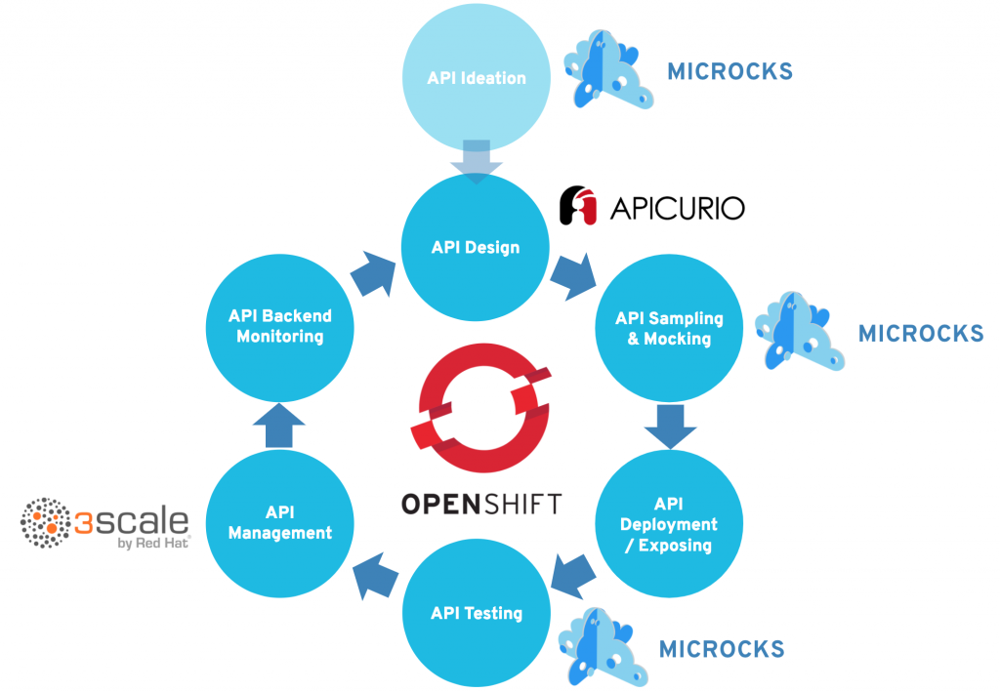

# api-lifecylce workshop

- Check inventory for variables.
- Working `oc` login.

Install

```
ansible-playbook -i workshop.inventory install.yml
```
Uninstall
```
ansible-playbook -i workshop.inventory uninstall.yml
```

Provisions:

- RedHat Single Sign On Server
- 3Scale API Management
- Apicurio
- Microcks




## Workshop

`Agenda`

- https://github.com/RedHatWorkshops/dayinthelife-integration/tree/master/docs/labs/developer-track

`Audience:` API Developer

`Scope:` Walk the user through an API development and integration process leveraging OpenShift, Ansible, Apicurio, Microcks, Fuse, 3scale AMP

1. [Review Apicurio API Designer](https://github.com/RedHatWorkshops/dayinthelife-integration/tree/master/docs/labs/developer-track/lab01/walkthrough.adoc)
2. [Microcks API Mocking](https://github.com/RedHatWorkshops/dayinthelife-integration/tree/master/docs/labs/developer-track/lab02/walkthrough.adoc)
3. [Swagger to REST](https://github.com/RedHatWorkshops/dayinthelife-integration/tree/master/docs/labs/developer-track/lab03/walkthrough.adoc)
4. [SOAP to Rest](https://github.com/RedHatWorkshops/dayinthelife-integration/tree/master/docs/labs/developer-track/lab04/walkthrough.adoc)
5. [Managed API Endpoints](https://github.com/RedHatWorkshops/dayinthelife-integration/tree/master/docs/labs/developer-track/lab05/walkthrough.adoc)
6. [API Developer Portal](https://github.com/RedHatWorkshops/dayinthelife-integration/tree/master/docs/labs/developer-track/lab06/walkthrough.adoc)
7. [API Consumption](https://github.com/RedHatWorkshops/dayinthelife-integration/tree/master/docs/labs/developer-track/lab07/walkthrough.adoc)
8. [Fuse Online and 3scale Smart Discovery Bonus Lab](https://github.com/RedHatWorkshops/dayinthelife-integration/tree/master/docs/labs/developer-track/../citizen-integrator-track/lab07/walkthrough.adoc)

Help for the needy:

```
# Default logins created by installer
SSO  (secure-sso-sso.apps):        keyadmin / keypassword
3scale (3scale-admin.apps):        admin / password
Apicurio (apicurio-studio.apps):   user1 / openshift
Microcks (microcks.apps):          user1 / openshift
Gogs (gogs.apps):                  user1 / openshift
```